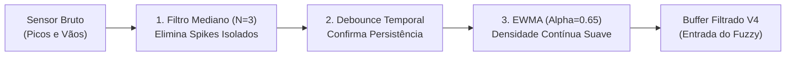

# Arquitetura, Física do Processo e Cálculos do Controle de Velocidade V4

Este documento é o memorial técnico de cálculo e arquitetura de engenharia do projeto **`Controle_Velocidade_4`**. Ele consolida todos os conceitos matemáticos, heurísticas de controle, tratamento de sinais e regras operacionais desenvolvidas para o controle avançado de velocidade da enchedora em linhas de envase industrial (cervejaria / bebidas).

---

## 1. O Problema Industrial: A Enchedora como Máquina Mestra

Em uma linha de envase de alta velocidade, a **Enchedora (Filler)** é o coração da linha e a máquina que dita o ritmo de produção (*benchmark machine*):

```
[Despaletizadora/DPL] ➔ (B1) ➔ [ECI] ➔ (B2) ➔ [[ ENCHEDORA ]] ➔ (B3) ➔ [Pasteurizador] ➔ (B4) ➔ [Rotuladora/Empacotadora]
```

### 1.1 Impacto no Produto (Qualidade da Cerveja)
* **TPO (Total Packaged Oxygen / Oxigênio Dissolvido):** Paradas bruscas ou variações rápidas de velocidade despressurizam o carrossel, rompem o colchão de gás inerte ($CO_2$) e provocam sucção de ar atmosférico para dentro do gargalo. Isso oxida os compostos aromáticos da cerveja, degrada o sabor (*stale flavor*) e reduz drasticamente o *shelf-life*.
* **Espumamento (*Fobbing*) e Perda de Volume:** Trancos mecânicos e acelerações repentinas nas estrelas de transferência causam agitação no líquido carbonatado, provocando transbordamento de espuma, subenchimento de garrafas e descarte em massa na inspetora eletrônica de nível.

### 1.2 Impacto Mecânico no Equipamento
* O carrossel rotativo de uma enchedora pesa dezenas de toneladas e opera com centenas de válvulas mecânicas/eletropneumáticas de alta precisão.
* Saltos de setpoint em degrau (*step change*) geram choque mecânico (*jerk*), folgas no pinhão e coroa de acionamento, quebra de garrafas nas guias de entrada/saída e descalibração das molas das válvulas.

### 1.3 Objetivo Estratégico do Controlador
* **Maximizar a produção:** Rodar a enchedora o máximo de tempo na velocidade nominal de projeto ou em sobrevelocidade segura.
* **Eliminar microparadas:** Em vez de parar a máquina quando um buffer oscila, modular suavemente a velocidade para uma marcha reduzida segura, mantendo o fluxo contínuo.
* **Suavizar transições:** Respeitar a inércia mecânica através de limitadores de taxa de aceleração (*slew rate*).
* **Retomada antecipada:** Arrancar a enchedora de forma sincronizada com a máquina subsequente sem esperar o esvaziamento total das esteiras.

---

## 2. A Física dos Buffers de Acúmulo e os Sensores de Esteira

### 2.1 Como os Níveis de Buffer são Medidos em Campo
Ao longo das esteiras de transporte entre máquinas (ex: entre ECI e Enchedora, ou Enchedora e Pasteurizador), são instaladas fotocélulas ou sensores óticos digitais ($S_1, S_2, \dots, S_N$). 

O CLP calcula o percentual de acúmulo somando o total de sensores com feixe bloqueado:

$$\text{Acúmulo Bruto (\%)} = \frac{\sum_{i=1}^{N} S_i}{N} \times 100\% \quad \text{onde } S_i \in \{0, 1\}$$

### 2.2 Por que os Sensores não têm Ordem Fixa e Apresentam Ruído?
Em esteiras industriais de garrafas ou latas (fluxo de massa), os recipientes **não se comportam como fluido contínuo em um reservatório**:
1. **Efeito Sanfona e Ondas de Pressão:** Garrafas deslizam sobre as correntes de aço inoxidável ou acetal lubrificadas. Conforme a linha roda, formam-se ondas de compressão onde pacotes de garrafas acumulam no final da esteira (acionando sensores distantes) enquanto abrem vazios (*gaps*) no meio (desacionando sensores intermediários).
2. **Passagem Livre vs. Acúmulo Real:** Uma garrafa isolada que apenas passa em alta velocidade cruza o feixe ótico em $0.1\text{s} - 0.2\text{s}$. Se o CLP ou o banco de dados capturar esse milissegundo, ele computa aquele sensor como "acúmulo", gerando um falso pico de ocupação.
3. **Interferências Óticas:** Gotas de água, espuma de lubrificante, vapor do pasteurizador e reflexos no vidro molhado causam interrupções espúrias.

### 2.3 A Evidência Real dos Dados Fabris
No histórico real coletado da fábrica (`dados_completos_fabrica.csv`), o buffer de entrada (`accumulation_percentage_eci_to_filler_null`) apresentou quedas bruscas irreais:
* **$13:55:00$:** Buffer = **$59.6\%$**
* **$13:55:30$:** Buffer = **$18.7\%$** *(queda brutal de 41% em 30 segundos!)*
* **$13:56:00$:** Buffer = **$59.6\%$** *(retorno instantâneo ao valor anterior)*

**Consequência se o sinal fosse deixado bruto:**
O controlador fuzzy enxergaria $18.7\%$ (abaixo do limiar de falta de $31.5\%$) e pisaria no freio da enchedora bruscamente. Trinta segundos depois, veria $59.6\%$ e aceleraria com força total. Essa oscilação descontrolada (*hunting / chattering*) destrói a mecânica e a eficiência da fábrica.

---

## 3. Pipeline de Dados 100% em Software (Sem Intervenção de Campo)

Para tornar a solução plug-and-play e escalável para dezenas de linhas sem precisar reprogramar CLPs ou medir esteiras com trena, implementamos um pipeline de dados em software composto por 3 estágios:



### 3.1 Estágio 1: Filtro Mediano Móvel ($N=3$)
Para cada amostra $t$, a mediana matemática de uma janela de 3 pontos elimina qualquer spike impulsivo de 1 ciclo sem introduzir o atraso de fase de uma média móvel convencional:

$$B_{\text{med}}(t) = \text{mediana}\left(B(t-1), B(t), B(t+1)\right)$$

* No caso da série $[59.6\%, 18.7\%, 59.6\%]$, a mediana é exatamente **$59.6\%$**. O pico de 41% é totalmente neutralizado.

### 3.2 Estágio 2: Debounce de Persistência Temporal em Software
Um degrau de buffer só é aceito como tendência real se persistir por pelo menos **2 amostras consecutivas na mesma direção**. Variações que batem e voltam em 1 amostra são tratadas como garrafas em trânsito e descartadas.

### 3.3 Estágio 3: Filtro Exponencial de Densidade de Ocupação (EWMA)
O filtro EWMA (*Exponentially Weighted Moving Average*) atua como um integrador contínuo de densidade de massa:

$$B_{\text{filtrado}}(t) = \alpha \cdot B_{\text{med}}(t) + (1 - \alpha) \cdot B_{\text{filtrado}}(t - 1)$$

* Adotamos $\alpha = 0.65$. O sinal resultante é liso, estável e reflete o **volume real de garrafas acumuladas**.

---

## 4. Balanço de Massa Feedforward com Máquinas Vizinhas

O nível de um buffer de acúmulo é o integrador da diferença de vazão:

$$\frac{dB(t)}{dt} = \frac{V_{\text{in}}(t) - V_{\text{out}}(t)}{\text{Capacidade da Esteira}}$$

Controlar a máquina olhando apenas o nível acumulado do buffer é um controle reativo por atraso. Quando o buffer de saída atinge $70\%$, o excesso de garrafas já foi produzido pela enchedora há minutos.

O V4 implementa **Balanço de Massa Feedforward**:
* **$V_{\text{in}}$ (Máquina a Montante):** Mede a velocidade da máquina imediatamente anterior (ex: ECI).
* **$V_{\text{out}}$ (Máquina a Jusante):** Mede a velocidade da máquina imediatamente posterior (ex: Pasteurizador).
* Se $V_{\text{out}} < 0.85 \cdot V_{\text{nom}}$, o algoritmo antecipa que o buffer de saída vai encher e inicia a modulação suave preventivamente.
* Se $V_{\text{in}} < 0.85 \cdot V_{\text{nom}}$, o algoritmo antecipa que o buffer de entrada vai secar e inicia a redução preventiva.

---

## 5. Retomada Antecipada por Tendência de Aceleração ($\frac{dV}{dt} > 0$)

### 5.1 O Problema do Atraso de Retomada Tradicional
Quando o Pasteurizador destrava de uma parada e começa a acelerar, o buffer $B_3$ (entre a enchedora e o pasteurizador) ainda está cheio (ex: $80\% - 85\%$). 
No controlador convencional, a enchedora fica travada em velocidade reduzida até que o buffer baixe abaixo do limiar ($b_{3\_opt} \approx 69\%$). Isso causa uma perda gigantesca de vazão (tempo morto desnecessário).

### 5.2 A Lógica de Retomada Sincronizada V4
O V4 calcula a derivada temporal suavizada da máquina a jusante:

$$\Delta V_{\text{out}}(t) = \frac{V_{\text{out}}(t) - V_{\text{out}}(t - \Delta t)}{\Delta t}$$
$$\text{Trend}_{V_{\text{out}}}(t) = 0.5 \cdot \Delta V_{\text{out}}(t) + 0.5 \cdot \text{Trend}_{V_{\text{out}}}(t - \Delta t)$$

Determina-se o grau de aceleração da máquina da frente:

$$\mu_{\text{acelerando}} = \text{clip}\left(\frac{\text{Trend}_{V_{\text{out}}} - 20.0}{100.0}, 0.0, 1.0\right)$$

O peso da regra de saída cheia ($w_{\text{saida\_cheia}} = \mu_{B3\_alto}$) é desmembrado em:

$$w_{\text{reduz}} = \mu_{B3\_alto} \cdot (1.0 - \text{peso\_retomada} \cdot \mu_{\text{acelerando}})$$
$$w_{\text{retomada\_sinc}} = \mu_{B3\_alto} \cdot (\text{peso\_retomada} \cdot \mu_{\text{acelerando}})$$

**Efeito Prático:** Se o pasteurizador já está arrancando ($\text{Trend}_{V_{\text{out}}} > 20\text{ CPH/s}$), ele está drenando garrafas da esteira a uma taxa conhecida. A enchedora recebe permissão imediata para iniciar sua aceleração na rampa, recuperando a vazão nominal em sincronia com a linha!

---

## 6. Proteção Mecânica em Dupla Camada e Suporte a Máquinas Antigas

Para garantir que o setpoint despachado ao CLP nunca agrida a mecânica — especialmente em **máquinas antigas** que possuem folgas em pinhão/coroa, acionamentos analógicos ou desgaste mecânico acumulado —, o V4 opera com um sistema de **Dupla Camada de Suavidade** complementado por **Banda Morta Anti-Tremor**:

### 6.1 Camada 1: Rampa Fuzzy Estática por Nível de Buffer (Mantida da V3)
A rampa fuzzy trapezoidal opera continuamente dentro do motor de inferência:
* **`rampa_b2`:** $\mathbf{19.3\%}$ de largura de transição no pulmão de entrada ($B_2$).
* **`rampa_b3`:** $\mathbf{18.5\%}$ de largura de transição no pulmão de saída ($B_3$).

**Como atua:** O cálculo do setpoint alvo **nunca é em degrau liga/desliga**. Conforme o buffer varia ao longo dessa faixa percentual, o peso das regras varia suave e continuamente, modulando a velocidade de forma linear e proporcional ao nível físico do acúmulo (equivalente a uma rampa de bloco SCL no CLP).

### 6.2 Camada 2: Limitador Temporal de Rampa (*Slew-Rate Limiter*)
A segunda camada atua no domínio do tempo, antes do envio ao CLP:
Mesmo que ocorra uma perturbação externa severa e o nível do buffer despranque instantaneamente, a enchedora **não sofre variação em degrau**:

$$V_{\text{final}}(t) = V_{\text{final}}(t-1) + \text{clip}\left(V_{\text{alvo}}(t) - V_{\text{final}}(t-1), -\Delta V_{\text{max\_ciclo}}, +\Delta V_{\text{max\_ciclo}}\right)$$

Onde o degrau máximo permitido no ciclo é proporcional ao tempo $\Delta t$ decorrido:
$$\Delta V_{\text{max\_ciclo}} = \left(\frac{\text{Max\_Rampa\_CPH\_Passo}}{30.0}\right) \times \Delta t$$

### 6.3 Banda Morta Anti-Chattering para Máquinas Antigas (`Banda_Morta_CPH`)
Em máquinas antigas, fazer pequenos ajustes de $50$, $100$ ou $200\text{ CPH}$ a cada ciclo de 30 segundos provoca vibração desnecessária no motor, desgaste em potenciômetros digitais e fadiga mecânica.

Implementamos a **Banda Morta**:
* Se a diferença entre a velocidade alvo e a velocidade atual for menor que o limiar configurado:
  $$\text{SE } |V_{\text{alvo}} - V_{\text{atual}}| < \text{Banda\_Morta\_CPH} \longrightarrow V_{\text{alvo}} = V_{\text{atual}}$$
* **Configuração Padrão:** $\mathbf{300.0\text{ CPH}}$. Pequenas oscilações transitórias deixam a máquina rodando em velocidade **$100\%$ constante**.

### 6.4 Tabela de Calibração de Rampa para Diferentes Perfis de Máquinas

No arquivo [`config_colunas.json`](file:///home/antonio/Projetos/OtimizadorSegue/Controle_Velocidade_4/config_colunas.json), o parâmetro `Max_Rampa_CPH_Passo` permite customizar a velocidade da rampa para o perfil mecânico exato da enchedora:

| Perfil da Máquina | `Max_Rampa_CPH_Passo` (30s) | Taxa Efetiva | Tempo para Modular $6.500\text{ CPH}$ | Aplicação Recomendada |
| :--- | :---: | :---: | :---: | :--- |
| **Padrão de Fábrica** | `3000.0 CPH` | $100\text{ CPH/s}$ | $\mathbf{\approx 65\text{ segundos}}$ | Enchedoras modernas (acionamento servo ou inversor de alta dinâmica). |
| **Máquinas Antigas (Conservadora)** | `1000.0 CPH` | $33\text{ CPH/s}$ | $\mathbf{\approx 3.2\text{ minutos}}$ | Enchedoras antigas com folga mecânica ou inversores analógicos sensíveis. |
| **Ultra-Conservadora (Crítica)** | `500.0 CPH` | $16\text{ CPH/s}$ | $\mathbf{\approx 6.5\text{ minutos}}$ | Máquinas muito velhas com histórico de quebra de garrafas ou trancos no carrossel. |

### 6.5 Harmonia com o Inversor de Frequência (Drive)
No painel de acionamento elétrico da enchedora, os inversores de frequência (Danfoss, SEW, Siemens) já possuem um parâmetro interno de rampa em curva S (*S-Curve de 15 a 30s*). Como o algoritmo entrega setpoints já escalonados em rampa suave e estabilizados por banda morta, os dois sistemas operam em perfeita sintonia mecânica, sem conflito de malha.

---

## 7. Modo Sprint / Sobrevelocidade Condicionada ($101\% - 105\%$)

Em momentos onde a linha está completamente desimpedida, a enchedora pode operar em sobremarcha controlada para recuperar volume de paradas anteriores.

### Critérios Obrigatórios para o Sprint:
1. $B_2 \ge b_{2\_opt} + 10\%$ (estoque de garrafas na entrada abundante);
2. $B_3 \le b_{3\_opt} - 10\%$ (esteira de saída livre);
3. $V_{\text{in}} \ge 90\% \cdot V_{\text{nom}}$ e $V_{\text{out}} \ge 90\% \cdot V_{\text{nom}}$ (máquinas vizinhas em pleno regime).

$$V_{\text{sprint}} = V_{\text{nominal}} \times \text{Fator\_Sprint} \quad (\text{ex: } 60.000 \times 1.01 = 60.600\text{ CPH})$$

---

## 8. Arquitetura do Motor Fuzzy Takagi-Sugeno (Ordem Zero)

O algoritmo fuzzy opera avaliando 4 posições de buffer ao longo da linha:

$$B_1 \text{ (Extremo Entrada)} \longrightarrow B_2 \text{ (Entrada Imediata)} \longrightarrow [[\text{ENCHEDORA}]] \longrightarrow B_3 \text{ (Saída Imediata)} \longrightarrow B_4 \text{ (Extremo Saída)}$$

### 8.1 Fuzzificação (Funções de Pertinência Trapezoidais)
A função `rampa_trapezoidal(x, a, b, c, d)` transforma níveis percentuais $[0\%, 100\%]$ em graus de pertinência $\mu \in [0, 1]$:

$$\mu(x) = \begin{cases} 
0, & x \le a \text{ ou } x \ge d \\
\frac{x - a}{b - a}, & a < x \le b \\
1, & b < x \le c \\
\frac{d - x}{d - c}, & c < x < d 
\end{cases}$$

* **$\mu_{B2\_baixo}$:** $x = B_2$, parâmetros $(-1, 0, b_{2\_lim} - \text{rampa}_{b2}, b_{2\_lim})$.
* **$\mu_{B2\_normal}$:** $x = B_2$, parâmetros $(b_{2\_lim} - \text{rampa}_{b2}, b_{2\_lim}, 100, 101)$.
* **$\mu_{B3\_normal}$:** $x = B_3$, parâmetros $(-1, 0, b_{3\_lim}, b_{3\_lim} + \text{rampa}_{b3})$.
* **$\mu_{B3\_alto}$:** $x = B_3$, parâmetros $(b_{3\_lim}, b_{3\_lim} + \text{rampa}_{b3}, 100, 101)$.
* **$\mu_{B1\_alerta}$ (Feedforward Falta Extrema):** $(-1, 0, b_{1\_lim}, b_{1\_lim} + \text{antecip}_{b1})$.
* **$\mu_{B4\_alerta}$ (Feedforward Acúmulo Extremo):** $(b_{4\_lim} - \text{antecip}_{b4}, b_{4\_lim}, 100, 101)$.

### 8.2 Base de Regras de Inferência

| Regra | Condição Antecedente | Consequente ($z_i$) | Peso ($w_i$) |
| :--- | :--- | :--- | :--- |
| **R1 (Falta Entrada)** | $B_2$ Baixo | $V_{\text{reduzida}}$ | $w_1 = \mu_{B2\_baixo}$ |
| **R2 (Acúmulo Saída)** | $B_3$ Alto (sem aceleração jusante) | $V_{\text{reduzida}}$ | $w_2 = \mu_{B3\_alto} \cdot (1 - P_{\text{ret}} \cdot \mu_{\text{acel}})$ |
| **R3 (Retomada Sinc)** | $B_3$ Alto + Máquina Jusante Acelerando | $V_{\text{nominal}}$ | $w_3 = \mu_{B3\_alto} \cdot (P_{\text{ret}} \cdot \mu_{\text{acel}})$ |
| **R4 (Alerta B1 FF)** | $B_1$ em Falta Extrema a Montante | $V_{\text{reduzida}}$ | $w_4 = \mu_{B1\_alerta}$ |
| **R5 (Alerta B4 FF)** | $B_4$ em Acúmulo Extremo a Jusante | $V_{\text{reduzida}}$ | $w_5 = \mu_{B4\_alerta}$ |
| **R6 (Fluxo Normal)** | $B_2$ Normal E $B_3$ Normal | $V_{\text{nominal}}$ | $w_6 = \min(\mu_{B2\_normal}, \mu_{B3\_normal}) \cdot (1 - w_{\text{sprint}})$ |
| **R7 (Sprint/Sobrevel)** | Buffers Desimpedidos E Máquinas $\ge 90\%$ | $V_{\text{sprint}}$ | $w_7 = 1.0 \text{ se Sprint senão } 0.0$ |

### 8.3 Defuzzificação (Média Ponderada Takagi-Sugeno)
$$V_{\text{alvo}} = \frac{\sum_{i=1}^{7} w_i \cdot z_i}{\sum_{i=1}^{7} w_i}$$

Com aplicação de teto e piso estritos:
$$V_{\text{alvo}} = \text{clip}\left(V_{\text{alvo}}, V_{\text{reduzida}}, V_{\text{sprint}}\right)$$

---

## 9. Otimizador Matemático CMA-ES e Digital Twin

Para calibrar os parâmetros de controle de forma global sem cair em mínimos locais, utilizamos o algoritmo **CMA-ES (Covariance Matrix Adaptation Evolution Strategy)**.

### 9.1 Vetor de 11 Parâmetros Otimizados ($x \in \mathbb{R}^{11}$)
1. $b_{1\_lim} \in [10, 30]\%$: Limiar de alerta no pulmão extremo a montante.
2. $b_{2\_lim} \in [15, 50]\%$: Limiar de modulação por falta de garrafas na entrada.
3. $b_{3\_lim} \in [50, 85]\%$: Limiar de modulação por acúmulo de garrafas na saída.
4. $b_{4\_lim} \in [70, 90]\%$: Limiar de alerta no pulmão extremo a jusante.
5. $\text{rampa}_{b2} \in [10, 35]\%$: Largura da transição fuzzy de entrada.
6. $\text{rampa}_{b3} \in [10, 35]\%$: Largura da transição fuzzy de saída.
7. $\text{antecip}_{b1} \in [5, 30]\%$: Janela de antecipação feedforward $B_1$.
8. $\text{antecip}_{b4} \in [5, 30]\%$: Janela de antecipação feedforward $B_4$.
9. $\text{min\_modulacao} \in [0.65, 0.90]$: Proporção mínima da velocidade nominal na marcha reduzida.
10. $\text{peso\_retomada} \in [0.10, 0.60]$: Intensidade do alívio de rampa na retomada com a máquina da frente.
11. $\text{fator\_sprint} \in [1.01, 1.05]$: Multiplicador de velocidade em sobremarcha.

### 9.2 Função Objetivo (Fitness Score)
$$\text{Score} = \text{Produção Total} - \left(N_{\text{socos}} \times 40.000\right) - \left(\text{Penalidade}_{\text{acel}} \times 15.0\right) - \text{Penalidade}_{\text{bounds}}$$

* **Produção Total:** $\sum V(t) \cdot \frac{\Delta t}{3600}$ garrafas entregues na simulação.
* **$N_{\text{socos}}$:** Amostras onde a máquina rodou acima da velocidade segura com buffers em zonas críticas de perigo ($B_2 \le 10\%$ ou $B_3 \ge 90\%$).
* **$\text{Penalidade}_{\text{acel}}$:** $\sum \left(\frac{\Delta V(t)}{1000}\right)^2$, penaliza variações bruscas de velocidade para forçar curvas suaves.

### 9.3 Simulação do Digital Twin
O simulador percorre todo o histórico da fábrica respeitando as **paradas mecânicas longas inegociáveis** (quebras reais onde $V_{\text{real}} == 0$ por mais de 10 minutos). Isso garante que o otimizador não gere "garrafas fantasmas" em períodos onde a máquina estava fisicamente desligada para manutenção.

### 9.4 Validação de Robustez em Modo Manutenção
O algoritmo executa uma prova de estresse matemática simulando a mesma lógica se a máquina estiver temporariamente limitada a rodar na velocidade lenta de manutenção (`Limiar_Velocidade_Manutencao` = $30.000\text{ CPH}$). Se a lógica não gerar choques mecânicos nesse cenário adverso, ela é aprovada para produção.

---

## 10. Sistema de Diagnóstico de Causa-Raiz e Identificação da Máquina Causadora (Enum JSON)

O arquivo [`motivos_modulacao_enum.json`](file:///home/antonio/Projetos/OtimizadorSegue/Controle_Velocidade_4/motivos_modulacao_enum.json) padroniza a identificação do motivo e aponta **qual máquina causou a modulação ou parada** sempre que a enchedora opera fora da nominal:

| ID | Código Enum | Descrição da Causa-Raiz | Máquina Causadora | Localização na Linha | Ação Recomendada |
| :---: | :--- | :--- | :--- | :--- | :--- |
| **0** | `NORMAL_FULL` | Velocidade Nominal ($100\%$) — Fluxo Equilibrado | `Nenhuma` | Linha Equilibrada | Nenhuma ação. Linha equilibrada. |
| **1** | `SPRINT_SOBREVELOCIDADE` | Sobrevelocidade / Sprint ($> 100\%$) — Linha Desimpedida | `Nenhuma (Oportunidade)` | Linha Livre | Aproveitar linha desimpedida para recuperar volume. |
| **10** | `FALTA_ENTRADA_B2` | Falta de Garrafas no Buffer de Entrada ($B_2$) | **ECI** | Montante Imediata | Verificar alimentação da máquina anterior (ECI/DPL). |
| **20** | `ACUMULO_SAIDA_B3` | Acúmulo de Garrafas no Buffer de Saída ($B_3$) | **Pasteurizador** | Jusante Imediata | Verificar máquina posterior (Pasteurizador). |
| **25** | `RETOMADA_ACELERANDO_JUSANTE` | Saída com Acúmulo, mas Jusante Acelerando (Retomada Sinc) | **Pasteurizador** (Acelerando) | Jusante Imediata | Aguardar avanço da rampa; máquina da frente destravando. |
| **30** | `CONFLITO_ENTRADA_SAIDA` | Duplo Conflito: Falta na Entrada e Acúmulo na Saída | **ECI e Pasteurizador** | Montante e Jusante | Desbalanceamento severo nas duas pontas da enchedora. |
| **40** | `FEEDFORWARD_ALERTA_B1` | Falta Extrema a Montante ($B_1$ Despaletizadora) | **Despaletizadora (DPL)** | Extremo Montante | Alerta preventivo na despaletizadora antes de secar a ECI. |
| **50** | `FEEDFORWARD_ALERTA_B4` | Acúmulo Extremo a Jusante ($B_4$ Empacotadora) | **Rotuladora / Empacotadora** | Extremo Jusante | Alerta preventivo no final de linha antes de travar o pasteurizador. |
| **60** | `LIMITADOR_RAMPA_MECANICA` | Transição Suave Limitada pelo Slew Rate Mecânico | **Enchedora** (Inércia Própria) | Centro da Linha | Aceleração gradual ativa (protegendo carrossel e cerveja). |
| **65** | `ENCHEDORA_LIMITADA_INTERNAMENTE` | Enchedora com Restrição Local (Modo Manutenção / Processo) | **Enchedora** (Própria Máquina) | Centro da Linha | Linha 100% apta, mas máquina limitada localmente (CO2, temp, operador). |
| **70** | `MAQUINA_MONTANTE_LENTA` | Máquina a Montante (ECI) em Baixa Velocidade | **ECI** | Montante Imediata | Redução preventiva para não esgotar o pulmão de entrada. |
| **80** | `MAQUINA_JUSANTE_LENTA` | Máquina a Jusante (Pasteurizador) em Baixa Velocidade | **Pasteurizador** | Jusante Imediata | Redução preventiva para não superlotar o pulmão de saída. |
| **90** | `PARADA_SEGURANCA_BUFFER` | Parada do CLP por Zona Crítica de Buffer | **ECI ou Pasteurizador** | Buffers Críticos | Intertravamento do CLP atuou para evitar quebra de garrafas. |
| **91** | `PARADA_INTERTRAV_ENTRADA_ECI` | Parada Crítica do CLP por Falta de Garrafas ($B_2 \le 10\%$) | **ECI (Lavadora/Inspetora)** | Montante Imediata | Intervenção na ECI/DPL: o pulmão de entrada secou completamente. |
| **92** | `PARADA_INTERTRAV_SAIDA_PASTEURIZADOR` | Parada Crítica do CLP por Acúmulo na Saída ($B_3 \ge 90\%$) | **Pasteurizador** | Jusante Imediata | Intervenção no Pasteurizador/Fim de Linha: pulmão de saída lotado. |
| **99** | `PARADA_PROPRIA_ENCHEDORA` | Parada Local da Enchedora (Falha Mecânica / Elétrica / Operador) | **Enchedora** (Própria Máquina) | Centro da Linha | Linha oferecia garrafas e saída desimpedida, mas a enchedora parou. |

### 10.1 Como o Sistema Isola se a Falha é da Própria Enchedora (100% Data-Driven)

Na engenharia de embalagem e análise de OEE, as paradas e perdas de velocidade da linha dividem-se matematicamente em 3 causas fundamentais:
1. **Falta a Montante (*Starvation*):** A enchedora quer rodar, mas a esteira de entrada secou ($B_2 \le 10\%$, ID 91). **Culpado: ECI / DPL.**
2. **Bloqueio a Jusante (*Blockage*):** A enchedora quer produzir, mas a esteira de saída entupiu ($B_3 \ge 90\%$, ID 92). **Culpado: Pasteurizador / Fim de Linha.**
3. **Falha Intrínseca da Própria Enchedora (*Breakdown / Internal*):**
   $$\text{SE } V_{\text{enchedora}} = 0 \quad \mathbf{E} \quad B_2 > 10\% \text{ (tem garrafas)} \quad \mathbf{E} \quad B_3 < 90\% \text{ (tem espaço livre)}$$
   $$\mathbf{\Longrightarrow} \text{A linha está 100\% pronta, logo a causa é EXCLUSIVA da ENCHEDORA (ID 99)}.$$

**Principais causas físicas atribuídas à Enchedora (IDs 60, 65 e 99):**
* **ID 99 (`PARADA_PROPRIA_ENCHEDORA`):**
  * Quebra mecânica de válvulas de enchimento, cames de elevação ou pinhão do carrossel.
  * Falha de acionamento elétrico (inversor em trip de sobrecorrente/temperatura).
  * Parada por quebra de garrafa / rotina de lavagem de cacos (*bottle burst cleanup*).
  * Falta de tampas na torre da recravadora acoplada à enchedora.
  * Intervenção do operador no pedestal (botão de emergência / parada para troca de formato).
* **ID 65 (`ENCHEDORA_LIMITADA_INTERNAMENTE`):**
  * A linha pede velocidade máxima ($60.000\text{ CPH}$), mas a máquina está rodando em marcha lenta reduzida (`Limiar_Velocidade_Manutencao` $\approx 30.000\text{ CPH}$). Motivos: operador travou o potenciômetro, baixa pressão no anel de $CO_2$, temperatura alta da cerveja (para evitar espumamento excessivo nas válvulas) ou tanque de produto com nível baixo.
* **ID 60 (`LIMITADOR_RAMPA_MECANICA`):**
  * A linha está limpa, mas a enchedora está acelerando suavemente em rampa temporal. A velocidade está temporariamente abaixo da nominal não por falha da linha, mas pela **inércia mecânica controlada da própria enchedora**.

---

## 11. Parâmetros dos Arquivos de Configuração

### 11.1 Arquivo `config_colunas.json`
| Parâmetro | Tipo | Descrição |
| :--- | :--- | :--- |
| `Arquivo_Dados` | String | Nome do arquivo CSV histórico para calibração. |
| `Col_Buffer_Antes_Entrada` | String | Coluna do buffer $B_1$ (Extremo a montante). *Opcional.* |
| `Col_Buffer_Entrada` | String | Coluna do buffer $B_2$ (Entrada imediata da enchedora). |
| `Col_Buffer_Saida` | String | Coluna do buffer $B_3$ (Saída imediata da enchedora). |
| `Col_Buffer_Pos_Saida` | String | Coluna do buffer $B_4$ (Extremo a jusante). *Opcional.* |
| `COL_V_Antes_Entrada` | String | Velocidade da primeira máquina a montante. |
| `COL_V_Entrada` | String | Velocidade da máquina de entrada imediata (ex: ECI). |
| `COL_V_ECH` | String | Velocidade real da Enchedora (suporta múltiplas separadas por vírgula). |
| `COL_V_Saida` | String | Velocidade real da máquina de saída imediata (ex: Pasteurizador). |
| `COL_V_Entrada_Pos_Saida` | String | Velocidade das máquinas pós-saída (ex: Rotuladoras paralelas). |
| `Velocidade_Nominal_ECH` | Float/Int | Velocidade nominal de projeto da enchedora em CPH (ex: `60000`). |
| `Limiar_Velocidade_Manutencao` | Float/Int | Limiar de velocidade em modo manutenção (ex: `30000`). |
| `Filtro_Minutos_Parada_Longa` | Int | Janela em minutos para detecção de quebras externas (ex: `10`). |
| `Fator_Sobremarcha` | Float | Multiplicador de velocidade máxima em sprint (ex: `1.02` = +2%). |
| `Min_Modulacao` | Float | Proporção mínima de modulação segura em relação à nominal (ex: `0.75`). |
| `Max_Modulacao` | Float | Proporção máxima de modulação padrão em regime normal (ex: `1.00`). |
| `Max_Rampa_CPH_Passo` | Float | Limite mecânico de variação por ciclo de 30s (ex: `3000.0` = $100\text{ CPH/s}$; `1000.0` para máquinas velhas). |
| `Banda_Morta_CPH` | Float | Limiar de tolerância para ignorar microajustes e vibrações em atuadores antigos (ex: `300.0 CPH`). |
| `Alpha_Filtro_Buffer` | Float | Fator de suavização do filtro EWMA de densidade de buffer (ex: `0.65`). |
| `Janela_Mediana_Buffer` | Int | Número de amostras da janela do filtro mediano (ex: `3`). |

### 11.2 Arquivo `parametros_controle_v4.json`
Armazena os parâmetros otimizados pelo CMA-ES consumidos pela função autônoma:
* `b1_lim`, `b2_lim`, `b3_lim`, `b4_lim`: Limiares operacionais dos buffers.
* `rampa_b2`, `rampa_b3`: Largura das transições fuzzy.
* `antecipacao_b1`, `antecipacao_b4`: Janelas de antecipação feedforward.
* `fator_reducao`: Piso de modulação em marcha lenta segura ($\approx 89.2\%$).
* `peso_retomada_tendencia`: Intensidade da antecipação de retomada ($\approx 10\%$).
* `fator_sprint`: Teto de sobremarcha permitido ($\approx 1.01$).
* `max_rampa_cph_passo`: Taxa máxima de aceleração mecânica por passo ($3.000\text{ CPH}$).
* `alpha_ewma`: Fator de suavização contínua do acúmulo ($0.65$).
* `velocidade_nominal_calculada`: Velocidade nominal adotada como referência ($60.000\text{ CPH}$).

---

## 12. Guia de Execução e Implantação

### 12.1 Assistente Interativo de Configuração
Para configurar ou alterar as colunas de qualquer linha fabril:
```bash
python assistente_configuracao.py
```

### 12.2 Treinamento CMA-ES e Simulação Histórica
Para rodar a calibração com Digital Twin e gerar todos os gráficos diários:
```bash
python otimizador_velocidade_v4.py
```

### 12.3 Testes Unitários Automatizados
Para verificar o cumprimento estrito do Slew Rate, ativação de Sprint, aceleração por tendência e enum de motivos:
```bash
python teste_unitario_v4.py
```

### 12.4 Teste de Bancada Live Interativo
Para simular manualmente diferentes cenários de buffer e velocidades vizinhas no terminal:
```bash
python controlador_velocidade_live_v4.py
```

### 12.5 Execução em Produção Conectada ao Grafana / InfluxDB
Para ler as variáveis em tempo real a cada 30 segundos, aplicar os filtros e despachar o setpoint com Motivo ID:
```bash
python controlador_velocidade_grafana_v4.py
```

---

## 13. Implementação em Automação Industrial e CLP (IEC 61131-3 SCL / Edge)

Para linhas onde a malha de controle é embarcada diretamente no CLP (Siemens S7-1500 / Rockwell ControlLogix) ou executada em um IPC / Edge Industrial (Docker via OPC-UA), a lógica do V4 foi estruturada com complexidade computacional $O(1)$, sem laços de repetição ou matrizes pesadas:

### 13.1 Bloco de Função SCL (Siemens TIA Portal / Structured Text)
```pascal
FUNCTION_BLOCK "FB_ControleVelocidadeV4"
{ S7_Optimized_Access := 'TRUE' }
VAR_INPUT
    b1_raw, b2_raw, b3_raw, b4_raw : Real; // Níveis brutos de buffer (%)
    v_in_cph, v_out_cph           : Real; // Velocidades das máquinas vizinhas (CPH)
    delta_t_s                     : Real; // Tempo de varredura (ex: 30.0 s)
    v_nom_cph                     : Real; // Velocidade nominal da enchedora (ex: 60000.0)
    max_rampa_passo               : Real; // Rampa máx (ex: 3000.0 CPH padrão; 1000.0 velhas)
    banda_morta_cph               : Real; // Banda morta anti-chattering (ex: 300.0 CPH)
END_VAR
VAR_OUTPUT
    v_setpoint_cph                : Real; // Setpoint suave despachado ao inversor
    motivo_id                     : Int;  // Código de causa-raiz para IHM / MES
END_VAR
VAR
    b1_f, b2_f, b3_f, b4_f        : Real := 50.0; // Estados EWMA (alpha = 0.65)
    v_saida_ant                   : Real := 0.0;
    v_atual                       : Real := 60000.0;
END_VAR
// ... Implementação direta das equações das seções 3, 5, 6 e 8 ...
```

### 13.2 Arquitetura de Conexão Edge / Supervisório (OT / IT)
```
[ Sensores de Esteira / Inversores ]
              │ (I/O Digital / Analógico)
              ▼
    [ CLP de Linha (Siemens / Rockwell) ]
              │ (OPC-UA / Modbus TCP)
              ▼
   [ Gateway Edge / IPC Industrial ]
    - Python 3.11 em Container Docker com Watchdog
    - Leitura das tags a cada 30s
    - Execução da funcao_controle_v4.py
    - Despacho de:
        * Tag Setpoint_CPH (para o drive da enchedora)
        * Tag Motivo_ID (para IHM, SCADA e Grafana)
              │
              ├──► [ Painel de Linha / IHM ] (Exibe velocidade e motivo da modulação em texto)
              └──► [ InfluxDB & Grafana ] (Dashboard corporativo de performance e perdas)
```

---

## 14. Matriz de Governança dos Agentes Especializados (`AGENTS.md`)

O desenvolvimento da V4 seguiu estritamente as atribuições dos papéis especializados definidos no projeto:

| Agente | Contribuição e Validação na Versão V4 |
| :--- | :--- |
| **Leader** | Coordenou a integração dos requisitos da fábrica, garantindo foco no coração da linha (Enchedora), proteção de máquinas antigas e total viabilidade operacional. |
| **Memory** | Registrou a precedência da V3 (larguras de rampa de $19.3\%$ e $18.5\%$, $b_{2\_lim}=31.5\%$, $b_{3\_lim}=69.2\%$) e assegurou que o V4 preservasse essas conquistas adicionando as novas camadas. |
| **Process Specialist** | Validou o impacto de TPO (oxigênio dissolvido) e espumamento ($CO_2$), demonstrando por que paradas em degrau estragam a cerveja e por que a modulação suave contínua é mandatória. |
| **Data Scientist** | Analisou a física dos sensores óticos em esteiras de massa, identificando as falsas quedas de $41\%$ no histórico real e projetando o pipeline de 3 estágios (Mediana + Debounce + EWMA) 100% em software. |
| **Optimization Engineer** | Implementou a calibração global CMA-ES com função objetivo penalizando socos mecânicos e desvios bruscos, maximizando a entrega líquida de garrafas. |
| **Fuzzy Specialist** | Estruturou as 7 regras Takagi-Sugeno de ordem zero, integrando as rampas trapezoidais com alívio proporcional de retomada sincronizada. |
| **Control Engineer** | Projetou a dupla camada mecânica (rampa fuzzy estática + slew-rate limiter temporal dinâmico em CPH/s) e a banda morta anti-chattering de $300\text{ CPH}$ para proteção de acionamentos antigos. |
| **Failure Analyst** | Identificou os riscos de oscilação (*hunting*), saturação e o conflito histórico de mapeamento da enchedora, garantindo o enum de diagnóstico com códigos 0 a 99. |
| **Industrial Deployment** | Garantiu a prontidão para produção: complexidade $O(1)$, watchdog de 5 minutos para dados congelados no Grafana, independência de intervenção física e mapeamento para SCL/IEC 61131-3. |
| **Reviewer** | Conferiu a consistência técnica integral, a ausência de saltos em degrau, a estabilidade das equações e a integridade de todas as métricas industriais. |

