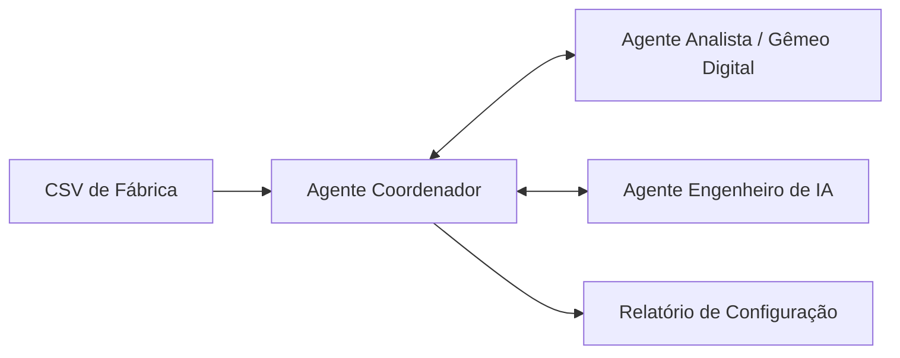
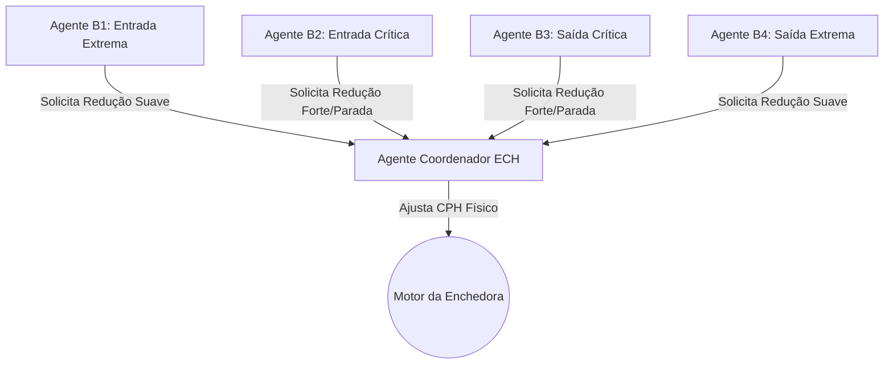

# Arquitetura de Agentes: Otimização de Linha de Envase

Este documento descreve a divisão do sistema em dois níveis de agentes:
1. **Time de Agentes de IA (Software):** Responsáveis por analisar os dados históricos (CSV) e propor os parâmetros ótimos.
2. **Agentes Controladores Físicos (CLP):** Responsáveis por executar a lógica de controle de velocidade em tempo real na fábrica.

---

## Nível 1: Time de Agentes de IA (Análise & Otimização)

Este time de agentes automatiza o processo de simulação e calibração dos gatilhos de controle utilizando dados do CSV histórico da linha de produção.

### 1. Agente Coordenador (Gerente de Otimização)
*   **Função (Role):** Orquestrador do fluxo de calibração.
*   **Objetivo (Goal):** Maximizar a eficiência global da enchedora e minimizar paradas severas.
*   **Instruções (Backstory):** 
    *   Recebe o arquivo de histórico da fábrica.
    *   Delega a limpeza e análise exploratória ao *Agente Analista de Dados*.
    *   Solicita que o *Agente Engenheiro de IA* comece a busca evolutiva pelos parâmetros de velocidade.
    *   Garante que os gatilhos recomendados não causem desgaste excessivo no motor da enchedora (evitando oscilação excessiva).
    *   Gera a recomendação final estruturada para o operador da fábrica.

### 2. Agente Analista de Dados (Gêmeo Digital)
*   **Função (Role):** Simulador físico de esteiras e buffers.
*   **Objetivo (Goal):** Calcular com precisão matemática o comportamento da linha sob novos parâmetros.
*   **Instruções (Backstory):**
    *   Trata e valida as colunas de buffers e velocidades do CSV.
    *   Roda o laço de simulação aplicando a **lógica de histerese** para imitar o comportamento real do CLP.
    *   Mede e reporta a performance de cada cenário proposto: número de paradas críticas salvas, produção líquida final e contagem de trocas de velocidade.

### 3. Agente Engenheiro de IA (Otimizador Matemático)
*   **Função (Role):** Especialista em busca e otimização multivariável.
*   **Objetivo (Goal):** Propor novas combinações de gatilhos e velocidades para aproximar a linha do máximo rendimento.
*   **Instruções (Backstory):**
    *   Utiliza estratégias inteligentes (Algoritmo Genético, Busca Bayesiana ou Evolução Diferencial).
    *   Ajusta os pesos de punição na função de score para forçar o sistema a evitar paradas de soco.
    *   Envia as propostas de parâmetros para teste no *Gêmeo Digital* e usa o feedback do score para guiar a próxima geração de parâmetros.

---

## Nível 2: Agentes Controladores Físicos (CLP / Fábrica)

Os agentes físicos representam as regras lógicas de controle realimentado rodando no CLP da fábrica com histerese.

### 1. Agente B1 - Entrada Extrema (Pulmão DPL-UIP)
*   **Ação:** Se o buffer secar abaixo do gatilho `b1_falta_extrema` e a Despaletizadora estiver lenta, solicita redução preventiva da enchedora. Limpa a solicitação quando subir acima do gatilho $+ 10\%$.

### 2. Agente B2 - Entrada Crítica (Pulmão UIP-ECH)
*   **Ação:** Se o buffer secar abaixo de `b2_falta_critica`, solicita redução drástica imediata. Se cair abaixo de $2\%$, solicita parada. Limpa a solicitação quando o buffer subir $+ 10\%$ acima do gatilho.

### 3. Agente B3 - Saída Crítica (Pulmão ECH-PZ)
*   **Ação:** Se o buffer acumular acima de `b3_acumulo_critico`, solicita redução drástica da enchedora. Se atingir $99\%$, solicita parada por acúmulo. Limpa a solicitação ao cair $- 10\%$ abaixo do gatilho.

### 4. Agente B4 - Saída Extrema (Pulmão PZ-EPC)
*   **Ação:** Se o buffer acumular acima de `b4_acumulo_extremo` e a Rotuladora estiver lenta, solicita redução preventiva. Limpa ao cair $- 15\%$ abaixo do gatilho.

### 5. Agente Coordenador ECH (CLP da Enchedora)
*   **Ação:** Avalia as solicitações dos Agentes B1 a B4 seguindo a hierarquia de prioridades (Parada Emergencial > Falta Crítica > Acúmulo Crítico > Acúmulo Extremo > Falta Extrema) e define a velocidade instantânea do motor da Enchedora.
